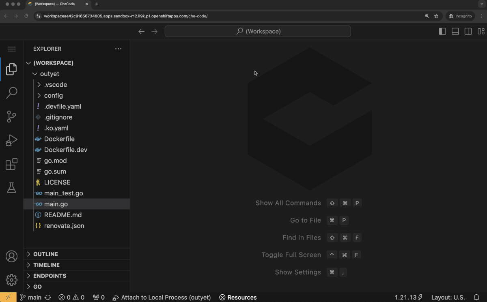

# kubectl debug-ide

A `kubectl` plugin to debug Pods with an IDE rather than the CLI.

:warning: This plugin is in its alpha stage and is missing some important feature compared to `kubectl debug`. Running
the IDE in an ephemeral debugging container (rather than copying the target Pod) is not supported. Workloads other than
`Pods` aren't supported either.

## How does `kubectl debug-ide` work?

Running `kubectl debug-ide` is similar to running `kubectl debug` (same flags) but an IDE is started and a git
repository is cloned within the debugging container.


The command returns the URL of the remote IDE (local IDE support is not implemented yet).
Opening the IDE URL in a browser allows debugging a process in the target container.



The IDE runs in the debugging container, but "local" debugging is possible as containers share the PID namespace.

## Examples

#### Debug a Pod by creating a copy and adding an IDE

The following command creates a copy of the Pod `$TARGET_POD`. In the copy it adds a debugging container where a git
repository is cloned and an IDE is started.

```bash
TARGET_POD="outyet"
DEBUGGING_CONTAINER_IMG="ghcr.io/l0rd/outyet-dev:latest"
TARGET_POD_COPY="outyet-debug"
GIT_REPO="https://github.com/l0rd/outyet.git"

kubectl debug-ide $TARGET_POD \
  --image $DEBUGGING_CONTAINER_IMG \
  --copy-to $TARGET_POD_COPY \
  --share-processes \
  --git-repository $GIT_REPO
```

:mega: The containers in the copy of target Pod share the PID namespace. This is helpful to attach the IDE debugger to
the target process as they run in separate containers.

#### Delete the debugging Pod

Delete the `DevWorkspace` Custom resource to stop the debugging session and cleanup the Kubernetes resources created by 
`kubectl debug-id`:

```bash
TARGET_POD="outyet"
kubectl delete ${TARGET_POD}-dw 
```

:mega: `kubectl delete pod` doesn't work, the DevWorkspace Operator restarts the Pod.

## Requirements

Running `kubectl debug-ide` requires the [DevWorkspace Operator](https://github.com/devfile/devworkspace-operator/tree/main).
`kubectl debug-ide` creates Custom Resources of type `DevWorkspace`.

Building (and currently installing too) requires [Go](https://go.dev/dl/).

## Installation

To install `kubectl debug-ide` clone this git repository and run `go install`:  

```sh
$ go install cmd/kubectl-debug_ide.go
```

## Shell completion

Copy the file `./kubectl_complete-ide` somewhere on `$PATH` and give it executable permissions to enable shell
completion for the plugin.

:mega: kubectl v1.26 or higher is required for shell completion to work for plugins.

## Cleanup

You can "uninstall" this plugin from kubectl by simply removing it from your PATH:

    $ rm  $GOBIN/kubectl-debug_ide

## Acknowledgments

The awesome [sample-cli-plugin](https://github.com/kubernetes/sample-cli-plugin) was used to kick off this plugin.

`kubectl debug-ide` is just a generator of DevWorkspace Custom Resources. The heavy lifting, the Cloud Development
Environment provisioning, is done by the [DevWorkspace Operator](https://github.com/devfile/devworkspace-operator) 
:heart:. Go check it out!
